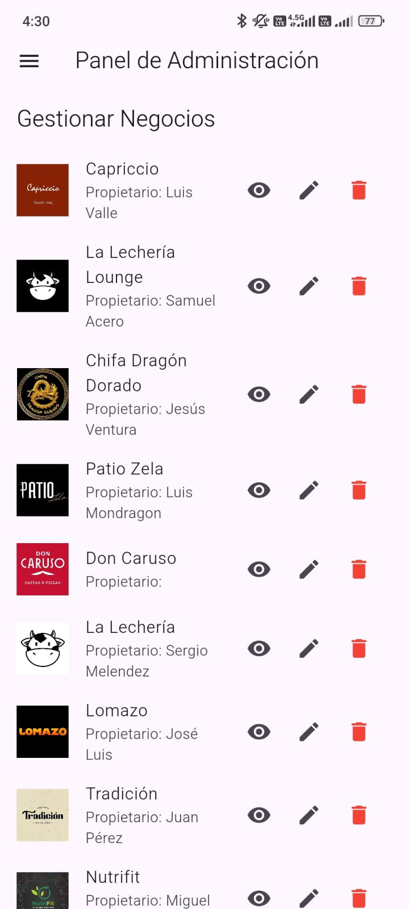

# SM2_EXAMEN_PRACTICO

## Descripción del Proyecto
Este proyecto incluye dos funcionalidades clave: **Gestión de Negocios** y **Agregar Tipo de Cocina**. Estas funciones permiten al administrador gestionar los negocios registrados y agregar diferentes tipos de cocina con imágenes y detalles relevantes para cada negocio.

## Historias de Usuario

### Historia 1: Gestionar Negocio
**Título**: Como administrador, quiero gestionar los negocios para poder listar, ver, editar y eliminar la información de los mismos de manera efectiva.

**Descripción**: La funcionalidad de gestión de negocios permite al administrador listar todos los negocios registrados, ver los detalles de cada negocio, editar la información y eliminar negocios cuando sea necesario. Incluye la verificación de datos relacionados antes de la eliminación.

---

### Historia 2: Agregar Tipo de Cocina
**Título**: Como administrador, quiero agregar tipos de cocina para clasificar los negocios de acuerdo con sus especialidades.

**Descripción**: Esta funcionalidad permite al administrador agregar nuevos tipos de cocina con imágenes, que se almacenan en Firebase Storage. El administrador puede agregar el nombre y una imagen para representar el tipo de cocina, facilitando la clasificación de los negocios.

## Enlaces y Referencias
- **Firebase**: Utilizado para almacenar imágenes y autenticar usuarios. [Firebase](https://firebase.google.com/)
- **Flutter**: Framework de desarrollo utilizado. [Flutter](https://flutter.dev/)
- **GitHub Repository**: [SM2_EXAMEN_PRACTICO](https://github.com/usuario/SM2_EXAMEN_PRACTICO)

